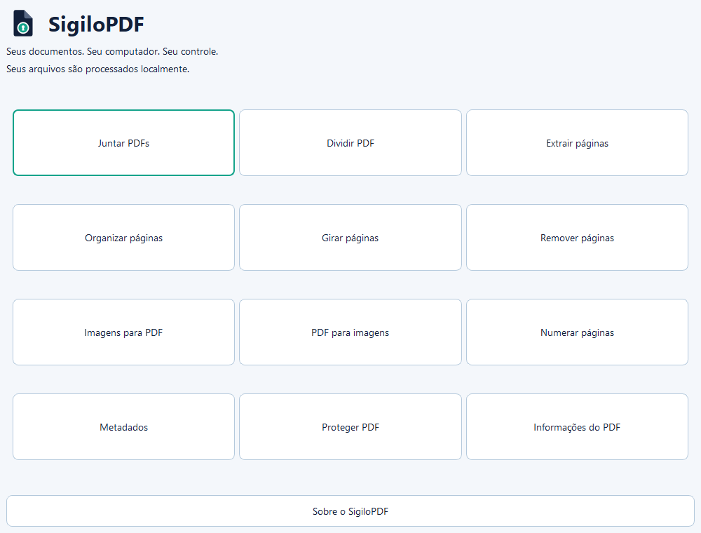
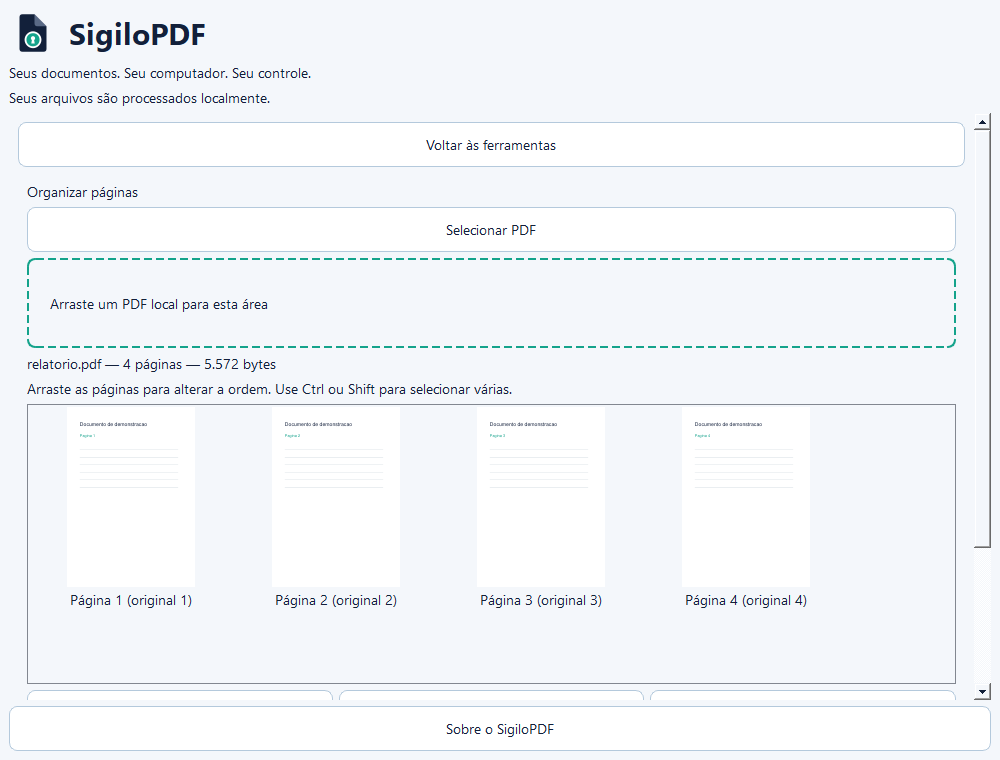
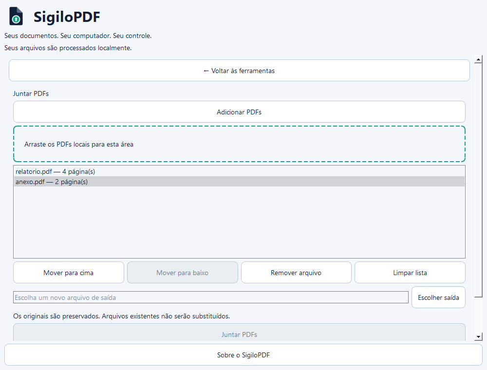
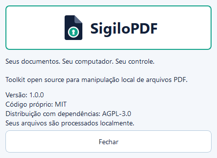

# SigiloPDF

**Versão atual: 1.1.0**

**Seus documentos. Seu computador. Seu controle.**

SigiloPDF é um aplicativo desktop open source para trabalhar com arquivos PDF localmente. Ele reúne tarefas comuns como juntar, dividir, reorganizar, converter e proteger documentos sem exigir o envio dos arquivos para serviços online.


## Por que este projeto existe?

Juntar páginas de um contrato ou reorganizar um relatório parece uma tarefa pequena. Ainda assim, muitas ferramentas pedem que você envie o documento para um serviço online.

Criei o SigiloPDF para poder fazer esse trabalho diretamente no computador, inclusive com arquivos que prefiro não compartilhar com terceiros.

## Privacidade

Os documentos são processados localmente pelo aplicativo. Não há upload, conta, telemetria, analytics ou armazenamento remoto de PDFs. Senhas informadas não são gravadas em arquivos, logs ou configurações; são usadas em memória durante a operação.

O SigiloPDF reduz a necessidade de entregar documentos a serviços externos, mas não substitui boas práticas de segurança no computador. Pastas sincronizadas podem enviar arquivos por ação de outros programas. Consulte a [política de privacidade](docs/PRIVACIDADE.md).

## O que já dá para fazer

- Juntar PDFs, dividir documentos e extrair páginas.
- Remover, girar e reorganizar páginas visualmente.
- Converter imagens em PDF e páginas de PDF em imagens.
- Numerar páginas.
- Consultar informações técnicas, visualizar e editar metadados e remover metadados comuns.
- Proteger PDFs com senha e remover a proteção com a senha correta.
- Comprimir PDFs com níveis Leve, Equilibrada, Forte ou tamanho desejado.

As operações criam novas saídas e preservam os originais. Nomes em conflito recebem um sufixo. A remoção de metadados comuns não elimina todas as possíveis informações identificadoras de um documento.

### Compressão

Reduza PDFs localmente ou informe um tamanho máximo desejado. Compare o resultado antes de salvar uma nova cópia. A meta pode não ser alcançada; modos mais fortes podem reduzir a qualidade das imagens. Consulte [modos e limitações](docs/COMPRESSAO.md).

## Interface

As capturas abaixo foram feitas no aplicativo, com documentos de demonstração.



<details>
<summary>Organização de páginas, junção e privacidade</summary>





</details>

## Executando pelo código-fonte

Instale Python 3.11 ou superior e Git. No PowerShell do Windows:

```powershell
git clone https://github.com/figueiredocn/SigiloPDF.git
cd SigiloPDF
python -m venv .venv
.venv\Scripts\python.exe -m pip install -r requirements.txt
.venv\Scripts\python.exe -m pip install --no-deps -e .
.venv\Scripts\python.exe -m app.main
```

A instalação das dependências precisa de acesso à internet. O processamento de documentos funciona offline. A validação desta versão foi feita no Windows; outros sistemas ainda precisam de validação própria.

Para executar os testes:

```powershell
.venv\Scripts\python.exe -m pytest -q
```

## Download

Os pacotes para Windows x64 estão na página de [Releases](https://github.com/figueiredocn/SigiloPDF/releases/tag/v1.1.0):

- **Instalador:** `SigiloPDF-1.1.0-windows-x64-setup.exe`, instalação por usuário em pt-BR.
- **Portátil:** `SigiloPDF-1.1.0-windows-x64-portable.zip`. Extraia a pasta inteira e abra `SigiloPDF.exe`; mantenha `_internal` ao lado dele.

Não é necessário instalar Python. O executável é validado no Windows com PATH restrito; a validação isolada desta versão está descrita nas notas da release. Os pacotes não possuem assinatura digital. `SHA256SUMS.txt` permite verificar a integridade dos downloads.

A distribuição completa segue AGPL-3.0; o código próprio também permanece sob MIT. As fontes correspondentes da aplicação e das dependências estão na mesma release, em ZIPs separados. Consulte [licença da distribuição](DISTRIBUTION_LICENSE.md), [fontes e reconstrução](docs/FONTES_CORRESPONDENTES.md) e [build para Windows](docs/DISTRIBUICAO_WINDOWS.md).

## Atualizações

O SigiloPDF pode verificar novas versões diretamente nas releases públicas do projeto. A verificação é opcional e não envia documentos ou informações sobre os arquivos utilizados. Em **Ajuda → Verificar atualizações**, consulte manualmente ou habilite a consulta automática, desativada inicialmente e limitada a uma vez a cada 24 horas. Baixar atualização abre a release oficial no navegador após seu clique; o aplicativo não substitui o executável.

## Documentação e contribuições

Consulte a [arquitetura](docs/ARQUITETURA.md), as [limitações de segurança](docs/SEGURANCA.md), o [roadmap](docs/ROADMAP.md) e o [guia de contribuição](CONTRIBUTING.md). Para relatar vulnerabilidades, leia [SECURITY.md](SECURITY.md).

O código do projeto usa a [licença MIT](LICENSE). As dependências têm licenças próprias, incluindo condições relevantes para redistribuição: veja [avisos de terceiros](THIRD_PARTY_NOTICES.md).

## Pré-visualização e seleção de páginas

Organizar, Dividir, Extrair, Remover e Girar compartilham miniaturas reais,
carregadas progressivamente. PDF para imagens e Numeração também permitem
seleção visual. Clique para selecionar; Ctrl adiciona páginas e Shift seleciona
um conjunto. Os campos de páginas continuam aceitando os intervalos existentes.
Na extração, a ordem digitada é preservada.

Duplo clique amplia a página, com navegação pelas setas, zoom de 25% a 200% e
ajuste à janela. Em Organizar, arraste páginas ou grupos para a posição desejada,
use os botões de movimentação ou Alt+←/→ e Ctrl+Z. A numeração mostra a posição
atual e a página original. Dividir também oferece pontos de divisão após páginas.
As prévias não rasterizam os PDFs salvos nem modificam os originais.

O diálogo Sobre fica em **Ajuda → Sobre o SigiloPDF**. O botão Repositório abre
o navegador somente mediante clique explícito, sem incluir dados de documentos.
O histórico completo permanece em [Releases](https://github.com/figueiredocn/SigiloPDF/releases). As versões anteriores continuam disponíveis.

## Autor

Criado e mantido por Felipe Figueiredo.

Este projeto surgiu como uma iniciativa pessoal para disponibilizar uma alternativa simples e aberta para tarefas comuns com documentos PDF.
